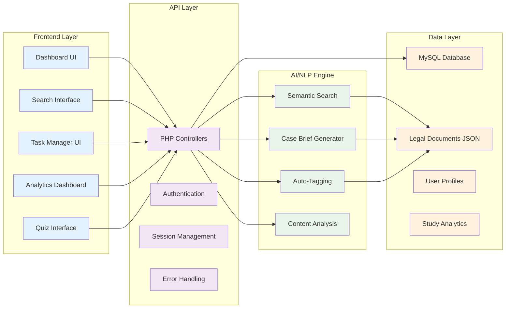

# LexiAid Application Flowchart

## High-Level Application Flow

```mermaid
graph TD
    A[Law Student User] --> B[LexiAid Dashboard]
    
    B --> C[Semantic Search]
    B --> D[Task Management]
    B --> E[Study Insights]
    B --> F[Case Brief Generator]
    B --> G[Quizzes & Learning]
    
    %% Semantic Search Flow
    C --> C1[Enter Legal Query]
    C1 --> C2[AI Processing with NLP]
    C2 --> C3{Semantic Match Found?}
    C3 -->|Yes| C4[Display Relevant Cases]
    C3 -->|No| C5[Fallback Keyword Search]
    C5 --> C4
    C4 --> C6[Auto-Tag Legal Categories]
    C6 --> C7[Store in Personal Library]
    
    %% Task Management Flow
    D --> D1[Add Academic Tasks]
    D1 --> D2[Priority Ranking System]
    D2 --> D3[Due Date Analysis]
    D3 --> D4[Task Dashboard Display]
    D4 --> D5[Progress Tracking]
    
    %% Study Insights Flow
    E --> E1[Track Study Time]
    E1 --> E2[Quiz Performance Analysis]
    E2 --> E3[Generate Charts & Metrics]
    E3 --> E4[Personalized Recommendations]
    E4 --> E5[Weak Area Identification]
    
    %% Case Brief Generator Flow
    F --> F1[Upload Legal Case Document]
    F1 --> F2[AI Text Analysis]
    F2 --> F3[Extract Key Components]
    F3 --> F4[Generate Structured Brief]
    F4 --> F5[Facts | Issues | Holdings | Reasoning]
    F5 --> F7[Save to Library]
    
    %% Quiz System Flow
    G --> G1[Select Topic/Category]
    G1 --> G2[Generate Quiz Questions]
    G2 --> G3[Interactive Assessment]
    G3 --> G4[Immediate Feedback]
    G4 --> G5[Performance Analytics]
    G5 --> E2
    
    %% Data Flow
    C7 --> H[Legal Documents Database]
    F5 --> H
    D5 --> I[User Progress Database]
    E5 --> I
    G5 --> I
    
    %% Technical Backend
    H --> J[MySQL Database]
    I --> J
    C2 --> K[Python NLP Engine]
    F2 --> K
    K --> L[Hugging Face Transformers]
    K --> M[Sentence Transformers]
    
    %% Frontend Technologies
    B --> N[Web Interface]
    N --> O[HTML5/CSS3/JavaScript]
    N --> P[Bootstrap Framework]
    N --> Q[Chart.js Visualizations]
    
    %% API Layer
    N --> R[PHP Backend APIs]
    R --> J
    R --> K
    
    style A fill:#e1f5fe
    style B fill:#f3e5f5
    style C fill:#e8f5e8
    style D fill:#fff3e0
    style E fill:#fce4ec
    style F fill:#e0f2f1
    style G fill:#f1f8e9
    style H fill:#fff8e1
    style I fill:#fff8e1
    style J fill:#ffebee
    style K fill:#e3f2fd
```

## System Architecture Overview



## Core User Journeys

### 1. Legal Research Journey
1. **Entry Point**: Student needs to research a legal concept
2. **Search**: Uses semantic search with natural language query
3. **AI Processing**: NLP engine finds relevant cases by meaning, not just keywords
4. **Results**: Displays ranked, relevant legal documents
5. **Organization**: Auto-tags content by legal area (Contract Law, Tort Law, etc.)
6. **Storage**: Saves to personal legal library for future reference

### 2. Case Study Journey
1. **Upload**: Student uploads a lengthy legal case document
2. **AI Analysis**: System processes document using transformer models
3. **Brief Generation**: Automatically extracts Facts, Issues, Holdings, Reasoning
4. **Review**: Student reviews and can edit the generated brief
5. **Library Integration**: Brief is saved and categorized for future study

### 3. Academic Management Journey
1. **Task Input**: Student adds assignments, deadlines, and priorities
2. **Smart Ranking**: System automatically prioritizes by urgency and importance
3. **Progress Tracking**: Visual dashboard shows completion status
4. **Analytics**: Generates insights on study patterns and productivity

### 4. Learning Assessment Journey
1. **Topic Selection**: Student chooses legal area for assessment
2. **Quiz Generation**: System creates relevant questions
3. **Interactive Assessment**: Real-time feedback during quiz
4. **Performance Analysis**: Detailed analytics identify weak areas
5. **Recommendations**: Personalized study suggestions based on results

## Key Technology Components

- **Frontend**: Modern web interface with responsive Bootstrap design
- **Backend**: PHP APIs with robust error handling and session management
- **AI/NLP**: Python-based engine using Hugging Face Transformers
- **Database**: MySQL for persistent data storage
- **Security**: User authentication and data protection
- **Analytics**: Real-time performance tracking and visualization

## Value Propositions

1. **Intelligent Search**: Find legal precedents by concept, not just keywords
2. **Time Savings**: Automated case brief generation reduces manual work
3. **Organization**: Smart categorization and tagging of legal materials
4. **Progress Tracking**: Data-driven insights into study effectiveness
5. **Personalization**: Adaptive recommendations based on individual performance
6. **Reliability**: Robust error handling ensures consistent user experience

---

*This flowchart represents the complete LexiAid system architecture and user experience flow, designed specifically for law students to enhance their academic research and study management.*
